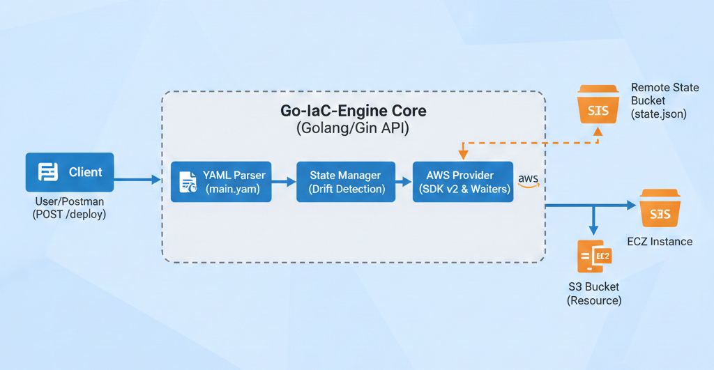

# IaC-Engine-Tool

A secure Infrastructure as Code (IaC) engine built with Go(Gin). This tool allows users to provision, destroy, update, and manage AWS resources programmatically via a REST API with automated remote state management.



## Documentation

- [Quickstart Guide](QUICKSTART.md): Step-by-step instructions to configure secrets, build, and run the engine locally.
- [Project Structure](PROJECT_STRUCTURE.md): An overview of the Go standard layout and architectural decisions.

## Features

- **Multi-Resource Support**: Provisions EC2 instances and S3 buckets via AWS SDK v2.
- **Remote State Management**: Uses Amazon S3 as a backend to track infrastructure state and ensure consistency.
- **Drift Detection & Lifecycle**: Implements intelligent updates for EC2 instances using AWS Waiters to manage state transitions.
- **API Security**: Secured with custom Gin middleware and X-API-Key authentication.
- **Environment Isolation**: Manages sensitive credentials using .env and godotenv.

## Tech Stack

- Language: Go (Golang)
- Framework: Gin Gonic
- Cloud: AWS (EC2, S3)
- Configuration: YAML
- Tools: Postman (Testing), AWS SDK v2

## Declarative Configuration

Resources are defined in a single `main.yaml` file, acting as the desired state for your infrastructure.

```yaml
resources:
  - type: aws_s3_bucket
    name: my-iac-engine-bucket-2026
    region: us-east-1

  - type: aws_ec2_instance
    name: my-first-web-server
    region: us-east-1
    ami: ami-0c55b159cbfafe1f0
    instance_type: t2.micro
```

## API Usage

The engine is controlled via a REST API. Ensure your server is running and your X-API-Key matches your .env configuration.

Provision or Update Resources:

```
curl -X POST http://localhost:8080/deploy \
 -H "X-API-Key: your-secret-password" \
 -H "Content-Type: application/json"
```

Tear Down Infrastructure:

```
curl -X DELETE http://localhost:8080/destroy \
 -H "X-API-Key: your-secret-password" \
 -H "Content-Type: application/json"
```

## Contributing and Forking

Contributions, issues, and feature requests are welcome. If you want to expand this IaC engine, feel free to fork the repository and submit a pull request.

**How to contribute:**

1. **Fork** the project on GitHub.
2. **Clone** your fork locally:

```bash
git clone [https://github.com/Swatantra-66/go-iac-engine.git](https://github.com/Swatantra-66/go-iac-engine.git)
```

3. Create a new branch for your feature or bugfix:

```bash
git checkout -b master_branch
```

4. Commit your changes with clear messages:

```bash
git commit -m "feat: add support for AWS DynamoDB"
```

5. Push the branch to your fork:

```bash
git push origin master_branch
```
